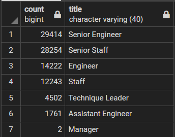
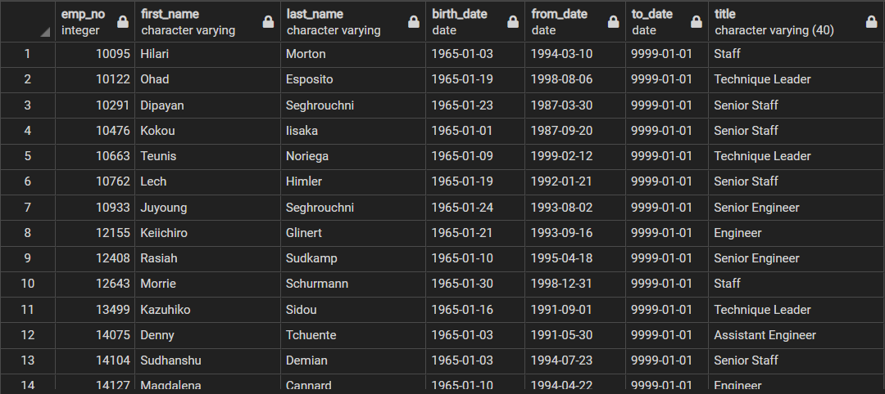
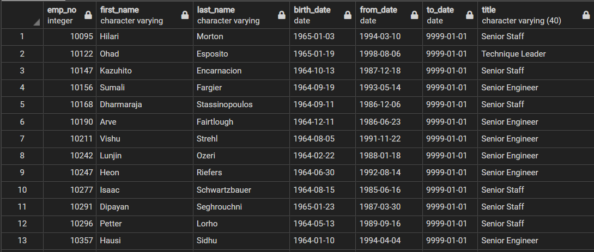

# **Pewlett Hackard Analysis**
## ***Overview of Analysis:***
The purpose of this analysis was to help prepare the Pewlett Hackard for a wave of upcoming retirements from the baby-boomer generation. This massive "Silver Tsunami" will leave huge labor gaps in the company and the analysis here will give Pewlett Hackard support during this transition. 
  

## ***Results:***
Please observe the following tables created for the analysis: 
  
### **TABLE ONE:**
The total employees eligible for retirement by department  

  
### **TABLE TWO:** 
The names and employee numbers of employees eligible for the mentorship program  

Here, one can conclude the following: 

-The staggering number of employees retiring, as observed in table one, is one that will leave a massive labor gap. Pewlett Hackard will need to have a game plan if they want to operate on a similar level of efficiency after the "Silver Tsunami." 
-It can also be observed in table one that the higher-level positions, such as Senior Engineer, will be retiring at a higher rate than lower-level positions, which means there is room for individuals in lower-level positions to get promoted.  
-In table two, we created a table that totaled the employees who were born in the year 1965 and recommended that these employees could potentially become mentors for individuals in lower-level positions who are looking for promotions.  
-The total number of employees eligible for mentorship based on these parameters is at 1,549, while the total number of employees retiring is at more than 90,000.  

  

## ***Summary:***

Judging by the observations above (1,549 mentors to 90,00+ retirees), there is not enough eligible mentors to help fill in the gaps created by the "Silver Tsunami". We would need to expand the parameters of the birth year. 
In the following table, the query for the birth year parameter was expanded from 1965 to 1964-1969. 
  

  
We also created a query that filtered by higher level jobs, as they would be more qualified to help lower-level employees get promoted. 
This expanded the number of mentors to just under 15,000. Pewlett Hackard could use this same code to expand or contract mentor eligibility parameters with ease to reach their mentorship program goals.

